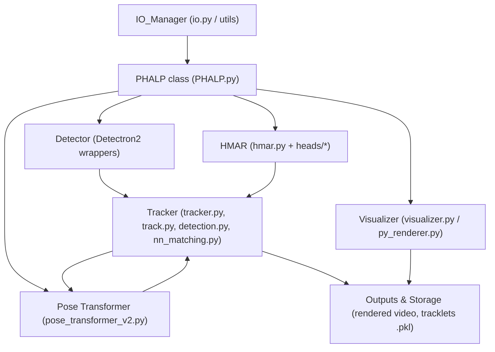
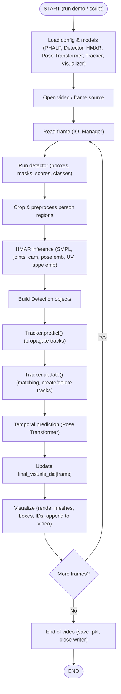
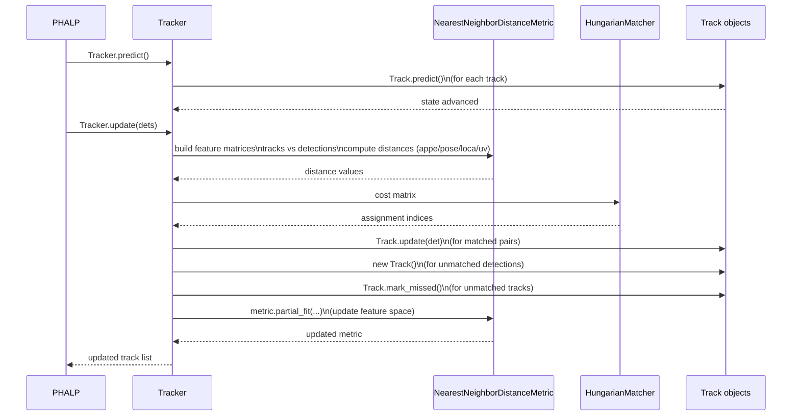
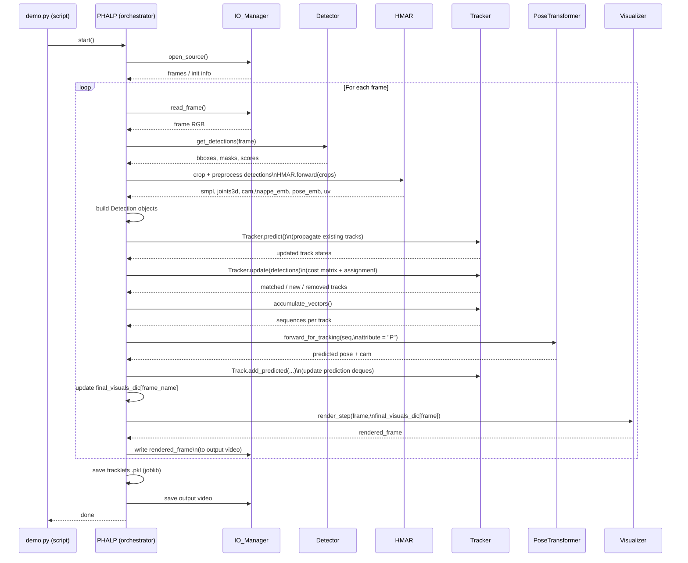

# PHALP Repo Deconstruction – System Architecture & Data Flow

> **Goal of this doc:**  
> Give a teaching-quality overview of **how PHALP works**, how its codebase is structured, and how data flows from **raw video frames** to **3D human tracklets**, with concrete pointers to files and functions.

---

## 1. Introduction: What PHALP Does and Why It Matters

**PHALP** (Tracking People by Predicting 3D Appearance, Location & Pose) is a **video-to-3D-tracks** system.  
Given a monocular video, it:

- Detects all humans in each frame (2D detection + masks).
- Lifts each detected person to a full **3D representation** (SMPL body model, 3D joints, camera).
- Extracts **appearance embeddings** and **pose embeddings** for tracking.
- Uses a **temporal model** (Pose transformer) to predict future pose and improve consistency.
- Runs a **multi-target tracking** system to maintain **stable identities** over time.
- Renders **3D body meshes** and outputs a `.pkl` with all per-frame/per-person data.

Why it matters:

- It’s a concrete, real-world example of integrating:
  - 2D detection
  - 3D human modeling
  - Time-series modeling
  - Multi-object tracking
  - Visualization/rendering
- It demonstrates how to architect a complex, GPU-heavy system where **model code, tracking logic, and pipeline orchestration** are cleanly separated.

---

## 2. Architecture Overview: High-Level System Design

At a high level, PHALP is a pipeline that looks like this:

- **Input video / frames**  
  → **Detector** (2D boxes & masks)  
  → **HMAR** (3D pose & appearance)  
  → **Tracker + Temporal model** (identity & future prediction)  
  → **Visualizer** (render meshes / boxes / IDs)  
  → **Outputs** (`.mp4` + `.pkl` of tracklets)

### 2.1 System Components Overview



### 2.2 Per-Video Flow


## 3. Core Components: Deep Dives into Major Subsystems

### 3.1 IO_Manager – Input/Output & Source Handling

**Files:** `io.py`, `phalp/utils/io.py`  
**Role:** Interface between disk/streams and the PHALP pipeline.

**Reads frames from:**

- Video file  
- Image folder  
- Other configured sources (e.g., YouTube, etc., if implemented)

**Provides:**

- `get_frames_from_source()` → list of frame identifiers  
- `read_frame(frame_name)` → actual RGB frame

**Handles:**

- Output video writing  
- Closing writers at the end of processing  

---

### 3.2 PHALP Orchestrator – The Main Pipeline Brain

**File:** `PHALP.py`

**Key methods:**

- `track()` – main loop over frames  
- `get_detections(...)`  
- `run_additional_models(...)`  
- `get_croped_image(...)`  
- `get_human_features(...)`  
- `forward_for_tracking(...)` (temporal prediction hooks)

**Responsibilities:**

**Initialization:**

- Load config  
- Initialize detector, HMAR, tracker, pose transformer, visualizer, `IO_Manager`

**Per-frame loop:**

1. Get frame from `IO_Manager`.  
2. Call detector.  
3. Optionally run extra models.  
4. Prepare crops & masks for HMAR.  
5. Run HMAR to extract SMPL, 3D joints, appearance, pose, location.  
6. Wrap into `Detection` objects.  
7. Call tracker’s `predict()` and `update()`.  
8. Call temporal model via `forward_for_tracking(...)`.  
9. Update `final_visuals_dic`.  
10. Optionally render via visualizer.

**Finalization:**

- Dump `final_visuals_dic` to `.pkl`.  
- Close video writer.  

---

### 3.3 Detector – 2D Instance Detection & Masks

**Files:** `utils_detectron2.py`, detector configs (used by `PHALP.setup_detectron2()`)

**Outputs for each frame:**

- `pred_bbox` – bounding boxes  
- `pred_masks` – segmentation masks  
- `pred_scores` – confidence scores  
- `pred_classes` – class IDs (people, etc.)

These detections define the persons that HMAR and the tracker operate on.

---

### 3.4 HMAR – Human Mesh & Appearance Regression

**Files:** `hmar.py` and `heads/*` submodules  

**Goal:** Convert person crops into rich 3D-centric features.

**Pipeline:**

1. Backbone (e.g., ResNet) → feature maps.  
2. Heads:  
   - **SMPL head** → pose & shape parameters  
   - **Camera head** → camera translation / weak-perspective parameters  
   - **Texture/UV head** → UV maps for the body  

**Additional steps:**

- `autoencoder_hmar(uv_vector, en=True)` → appearance embedding from UVs  
- `get_3d_parameters(pred_smpl_params, pred_cam, ...)` → SMPL structure, 3D and 2D joints, `camera_t`

**Per-person outputs include:**

- `smpl` – shape & pose parameters  
- `3d_joints`, `2d_joints`  
- `camera` & `camera_bbox`  
- `uv` / UV vector  
- Appearance embedding (`appe`)  
- Pose embedding (`pose`) – derived from HMAR outputs  
- Location embedding (`loca`) – from joints + camera  

These features feed both tracking and rendering.

---

### 3.5 Detection Wrapper – Packaging Features

**File:** `detection.py`

Wraps raw feature dict into a `Detection` object with:

- TLWH / XY bounding boxes for tracker  
- `detection_data` dict with:  
  - `bbox`, `mask`, `conf`  
  - `appe`, `pose`, `loca`, `uv`, `embedding`  
  - `smpl`, `camera`  
  - `3d_joints`, `2d_joints`  
  - `center`, `scale`, `size`  
  - `img_path`, `img_name`, `time`  
  - `ground_truth`, `annotations`, `extra_data`  

This gives the tracker a consistent, feature-rich object to work with.

---

### 3.6 Tracker & Track – Multi-Target Tracking

**Files:** `tracker.py`, `track.py`, `nn_matching.py`, `detection.py`

**Core ideas:**

- Each `Track` object represents a single person over time.  
- The `Tracker` coordinates:
  - Prediction (`predict()`)  
  - Matching (`update()`)  
  - Track creation & deletion  

---

#### 3.6.1 `Tracker.predict()`

For each track:

- `Track.predict(self.phalp_tracker, increase_age=True)`:
  - Increments age  
  - Performs optional motion prediction  

---

#### 3.6.2 `Tracker.update(detections, ...)`

**Steps:**

1. Build feature matrices:
   - Extract `appe`, `pose`, `loca`, `uv` from each `Detection`.  

2. Compute cost matrix with `NearestNeighborDistanceMetric.distance(...)`:
   - Appearance distance  
   - Pose distance  
   - Location distance  
   - UV-based distance (if used)  

3. Call Hungarian matching:
   - `linear_assignment.matching_simple(cost_matrix, ...)`  

4. For matched pairs:
   - `Track.update(detection, detection_id, shot)`  

5. For unmatched tracks:
   - `Track.mark_missed()`  

6. For unmatched detections:
   - `_initiate_track(detection, detection_id)`

Tracker Update Sequence Diagram


### 3.7 Tracklet Storage – How Track Objects Store History & Predictions

**File:** `track.py`

Each `Track` stores:

- `track_id`
- `track_data` dict containing:
  - `track_data['history']`: `deque(maxlen=cfg.phalp.track_history)`
    - Each element has:
      - `frame_idx` / `time`
      - `bbox`, `mask`
      - `appe`, `pose`, `loca`, `uv`
      - `smpl`, `camera`
      - `3d_joints`, `2d_joints`
      - `extra_data` / `annotations`
  - `track_data['prediction']`: dict of deques (length `cfg.phalp.n_init + 1`)
    - `prediction['pose']`, `prediction['loca']`, `prediction['smpl']`, etc.

**Key properties:**

- **History is bounded:** older observations are automatically evicted once `track_history` is exceeded.  
- **Predictions are also bounded:** only a few future steps are stored (up to `cfg.phalp.n_init + 1`).  

**Track lifecycle:**

- `Tentative` → `Confirmed` → `Deleted`  
- Transitions are driven by hits (successful matches) and misses (unmatched for too many frames).

---

### 3.8 Temporal Model – `Pose_transformer_v2`

**File:** `pose_transformer_v2.py`  

**Purpose:**  
For each track, given a sequence of past pose embeddings and metadata, predict a future pose (full SMPL + camera vector, 229-dim).

---

#### 3.8.1 Sequence Construction

**File:** `tracker.py`  
**Function:** `Tracker.accumulate_vectors(...)`

Reads from `track_data['history']` per track:

- Pose embeddings: `pose`  
- Spatial metadata: XY positions, scale, time  

Produces arrays:

- `seq_pose` – shape `[T, D_pose]`  
- `seq_meta` – shape `[T, D_meta]`  
- `seq_time` – shape `[T]` (normalized timings)

---

#### 3.8.2 Prediction Call

**File:** `PHALP.py`  
**Function:** `PHALP.forward_for_tracking(vectors, attribute="P", time=1)`

For pose:

- Calls:  
  `self.pose_predictor.predict_next(en_pose, en_data, en_time, time)`

**File:** `pose_transformer_v2.py`  
**Function:** `predict_next(...)`

Steps:

1. Reshape input.  
2. Normalize by mean/std (training-time statistics).  
3. Feed through transformer encoder (`lart_transformer`).  
4. Decode to 229-dim vector:  
   - `global_orient` (9)  
   - `body_pose` (207)  
   - `betas` (10)  
   - `cam` (3)

**Temporal Model Input Summary:**

- **Input:** pose embeddings + metadata (not raw SMPL).  
- **Output:** full SMPL + camera vector per future step.

---

### 3.9 Visualizer & Renderer

**Files:** `visualizer.py`, `py_renderer.py`

**Responsibilities (per frame):**

1. Take:
   - Raw frame  
   - Active tracklets (with SMPL + camera + joints)  

2. Reconstruct 3D meshes via SMPL.  

3. Project to image using camera parameters.  

4. Draw:
   - Mesh overlays  
   - Bounding boxes  
   - Track IDs / colors  
   - Optional masks, blur faces, etc.

5. Append rendered frame to output video.

---

## 4. Code Navigation Guide: How to Find & Understand Key Functionality

### 4.1 Start Here: Entry & Orchestrator

- `scripts/demo.py`
  - CLI entry point.  
  - Parses `video.source`, `video.output_dir`, config flags.  
  - Instantiates and calls into `PHALP` class.

- `phalp/PHALP.py`
  - Look at `__init__` to see which components are instantiated (detector, HMAR, tracker, temporal model, visualizer, IO).  
  - Look at `track()` as the main loop.

---

### 4.2 Then Follow the Pipeline

**Detection:**

- `PHALP.get_detections(...)`  
- `utils_detectron2.py` – actual Detectron2 predictor wrappers.

**Cropping & HMAR:**

- `PHALP.get_croped_image(...)`  
- `PHALP.get_human_features(...)`  
- `hmar.py` – read `forward`, `autoencoder_hmar`, `get_3d_parameters`.

**Detection Wrapping:**

- `detection.py` – `Detection` class.

**Tracking:**

- `tracker.py` – `Tracker.predict`, `Tracker.update`, `_match`.  
- `track.py` – `Track` data structure, `update`, `mark_missed`.

**Temporal Model:**

- `tracker.py` – `accumulate_vectors`.  
- `pose_transformer_v2.py` – `predict_next`, internal encoder.

**Visualization:**

- `visualizer.py` – orchestration of overlays.  
- `py_renderer.py` – SMPL mesh rendering and projection.

---

### 4.3 Config & Hyperparameters

- `phalp/configs/*` – Hydra configs.

Key entries to look for:

- `cfg.phalp.track_history` – maximum history length per track.  
- `cfg.phalp.n_init` – number of frames required to confirm a track.  
- `cfg.phalp.max_age` – maximum allowed misses before deleting a track.  
- Distance weights for:
  - Appearance  
  - Pose  
  - Location  
  - UV  

These control how the tracker balances different feature distances when matching detections to existing tracks.

## 5. Examples and Use Cases: Concrete Demonstrations

### 5.1 Run a Standard Demo

Basic command (example form, check actual README for exact syntax):

```bash
python scripts/demo.py \
    video.source=assets/videos/example.mp4 \
    video.output_dir="outputs/example_run"
```

**What happens:**

- Models are loaded (Detector, HMAR, Pose Transformer, etc.).
- All frames in `example.mp4` are processed through:
  - Detection
  - HMAR
  - Tracking
  - Temporal prediction
  - Visualization

**Outputs:**

- `outputs/example_run/output_video.mp4` – rendered video.  
- `outputs/example_run/results.pkl` – full `final_visuals_dic`.

---

### 5.2 Inspect `.pkl` Tracklets

Example Python snippet:

```python
import joblib

data = joblib.load("outputs/example_run/results.pkl")
print("Frames:", len(data))

# Inspect first frame
frame_name = sorted(data.keys())[0]
frame_tracks = data[frame_name]

for tid, track_info in frame_tracks.items():
    print("Track ID:", tid)
    print("  BBox:", track_info["bbox"])
    print("  Pose embedding shape:", track_info["pose"].shape)
    print("  SMPL keys:", track_info["smpl"].keys())
    print("  3D joints shape:", track_info["3d_joints"].shape)
```
### 5.3 Possible Research Use Cases

- Long-term identity tracking in crowded scenes.  
- 3D pose trajectories for behavior analysis.  
- Using PHALP as a preprocessing engine:
  - Feed 3D pose sequences into another model.  
  - Use appearance embeddings as inputs to a ReID or retrieval system.  

---

## 6. Visual Aids: Diagrams, Tables, and APIs
### 6.1 Per-Frame Processing Sequence (Component Interaction)


### 6.2 Component Summary Table

| Component           | File(s)                           | Role                                             | Key Outputs                                               |
|---------------------|-----------------------------------|--------------------------------------------------|-----------------------------------------------------------|
| IO_Manager          | `io.py`, `phalp/utils/io.py`      | Manage input video/frames and output video/files | Frames, metadata, saved `.mp4` and auxiliary files        |
| PHALP Orchestrator  | `PHALP.py`                        | Top-level pipeline control                       | Calls detection, HMAR, tracker, visualizer                |
| Detector            | `utils_detectron2.py`, configs    | 2D person detection + masks                      | `pred_bbox`, `pred_masks`, `pred_scores`, `classes`       |
| HMAR                | `hmar.py`, `models/heads/*`       | 3D pose, SMPL, appearance, UV prediction         | `smpl`, `3d_joints`, `2d_joints`, `cam`, `appe`, `uv`     |
| Detection wrapper   | `detection.py`                    | Wraps all per-person features into a Detection   | `detection_data` dict, TLWH/XY bbox formats               |
| Tracker             | `tracker.py`, `track.py`, `nn_matching.py` | Multi-object tracking + data association | Track IDs, track histories, per-frame track states        |
| Pose Transformer    | `pose_transformer_v2.py`          | Temporal pose prediction for each track          | Next-step SMPL pose + camera (e.g., 229-dim vector)       |
| Visualizer          | `visualizer.py`, `py_renderer.py` | 3D mesh/bbox/mask rendering                      | Rendered frames with overlaid meshes & track IDs          |
| Config System       | `phalp/configs/*` (Hydra)         | Configure models, thresholds, paths, modes       | Config objects passed into PHALP and submodules           |
| Serialization       | `PHALP.track()` (joblib), IO utils| Save tracking results                            | `.pkl` containing `final_visuals_dic`                     |

---

### 6.3 Feature Types vs Producing Components

| Feature / Quantity        | Producer Component          | Where It's Used                                             |
|---------------------------|-----------------------------|-------------------------------------------------------------|
| 2D bounding box (`bbox`)  | Detector (`utils_detectron2`)| Cropping, tracking geometry, visualization                  |
| Instance mask (`mask`)    | Detector                    | Masked crops for HMAR, optional visualization               |
| Confidence score (`conf`) | Detector                    | Filtering low-quality detections                            |
| UV texture (`uv`)         | HMAR                        | Appearance autoencoding, visualization                      |
| Appearance embedding (`appe`) | HMAR + `autoencoder_hmar` | Tracker cost matrix (appearance term)                       |
| Pose embedding (`pose`)   | HMAR                        | Tracker cost matrix (pose term), temporal model             |
| Location feature (`loca`) | HMAR / geometry utilities   | Tracker cost matrix (location term)                         |
| SMPL params (`smpl`)      | HMAR                        | 3D reconstruction, rendering, temporal model                |
| 3D joints (`3d_joints`)   | HMAR                        | Geometry reasoning, optional visualization                  |
| 2D joints (`2d_joints`)   | HMAR                        | Geometry/consistency checks, visualization                  |
| Camera params (`camera`)  | HMAR                        | 3D→2D projection, rendering                                 |
| Track ID                  | Tracker                     | Identity over time, coloring in visualization               |
| Predicted pose+cam        | Pose Transformer            | Future-aware tracking, smoother trajectories                |

---

### 6.4 API Summary by Class/Module

| Class / Module             | Method / API                     | Description                                                      | Important Args / Returns                                  |
|----------------------------|----------------------------------|------------------------------------------------------------------|-----------------------------------------------------------|
| `PHALP`                    | `track()`                        | Main processing loop over frames; coordinates entire pipeline    | Uses IO_Manager, detector, HMAR, tracker, visualizer      |
| `PHALP`                    | `get_detections(image, ...)`     | Run detector and post-process outputs into arrays                | Returns `pred_bbox`, `pred_masks`, scores, classes        |
| `PHALP`                    | `get_croped_image(...)`          | Crop + mask person regions, compute center & scale               | Returns crop tensors, metadata                            |
| `PHALP`                    | `get_human_features(...)`        | Run HMAR, autoencoder, get 3D params, package `detection_data`   | Returns list of `Detection` objects                       |
| `PHALP`                    | `forward_for_tracking(...)`      | Call pose transformer for next-step pose prediction              | Returns predicted pose + camera vectors                   |
| `HMAR`                     | `forward(crops)`                 | Main forward pass from crops to smpl/joints/cam/embeddings       | Input batch tensor, outputs dict of features              |
| `HMAR`                     | `autoencoder_hmar(uv, en=...)`   | Encode/decode UV map into appearance embedding                   | Returns appearance embedding                              |
| `HMAR`                     | `get_3d_parameters(...)`         | Convert raw SMPL+cam to 3D joints, camera translation            | Returns joints, `camera_t`, etc.                          |
| `Tracker`                  | `predict()`                      | Propagate all track states one step into the future              | No args, updates internal `Track` objects                 |
| `Tracker`                  | `update(detections, ...)`        | Perform data association and track management                    | Takes list of `Detection`, updates track set              |
| `Tracker`                  | `_match(dets)` (internal)        | Build cost matrix and run Hungarian matching                     | Uses Metric + `linear_assignment`                         |
| `Track`                    | `update(detection, ...)`         | Append new observation to history; update state                  | Takes a `Detection` object                                |
| `Track`                    | `mark_missed()`                  | Increment missed frame counter, possibly mark for deletion       | —                                                         |
| `Track`                    | `predict()`                      | Optional motion prediction for this track                        | —                                                         |
| `NearestNeighborDistanceMetric` | `distance(tracks, dets)`   | Compute pairwise distances across one or more feature types      | Uses `appe`/`pose`/`loca`/`uv` vectors                    |
| `NearestNeighborDistanceMetric` | `_pdist(a, b)` (internal)   | Pairwise distance (e.g., squared L2) between feature sets        | —                                                         |
| `Pose_transformer_v2`      | `predict_next(seq, meta...)`     | Given pose/history sequence, predict next pose+camera            | Inputs history tensors, returns 229-dim vector            |
| `Visualizer`               | `render_video_step(frame, tracks)`| Render one frame with meshes, boxes, IDs                        | Returns rendered frame (RGB)                              |
| `IO_Manager`               | `get_frames_from_source()`       | Enumerate frames from video, directory, or other source          | Returns list of frame identifiers                         |
| `IO_Manager`               | `read_frame(name)`               | Load a single frame as image tensor                              | Returns image data                                        |
| `IO_Manager`               | `save_video(...)`                | Finalize and write output video file                             | Writes `.mp4`                                             |

## 7. Code Organization & Build / Run Setup

### 7.1 Repository Layout

At a high level, the PHALP repo is organized into:

- `phalp/`
  - `PHALP.py` – main orchestrator class.
  - `hmar.py` – Human Mesh & Appearance Regression model.
  - `pose_transformer_v2.py` – temporal pose prediction model.
  - `tracker.py` – multi-object tracking logic and data association.
  - `track.py` – `Track` class and tracklet data structure.
  - `detection.py` – `Detection` wrapper for per-person features.
  - `visualizer.py` – visualization and video rendering.
  - `utils_*` – utility modules (Detectron2 wrapper, dataset helpers, IO, etc.).
  - `configs/` – Hydra configuration files for experiments and demos.

- `scripts/`
  - `demo.py` – main entry point script used for running PHALP on a video.

- `models/` or `checkpoints/` (varies by setup)
  - Pretrained HMAR / backbone weights, downloaded or cached at runtime.

### 7.2 Dependencies and Build Notes

At a minimum, PHALP relies on:

- PyTorch + CUDA (for HMAR, pose transformer, and possibly rendering).
- Detectron2 (for 2D person detection and masks).
- SMPL / SMPL-X body model code and data files.
- Hydra (for configuration management).
- Joblib (for saving `.pkl` results).

Typically you will:

1. Create a Python environment (conda/venv).
2. Install PyTorch with CUDA.
3. Install Detectron2 compatible with that PyTorch build.
4. Install remaining Python dependencies from `requirements.txt` or `setup.py`.

## 8. Key Abstractions & Extension Points

### 8.1 Conceptual Interfaces

Even though PHALP is implemented as plain Python classes, a few **implicit interfaces** show up:

- **Detector interface**
  - Expected to provide: `pred_bbox`, `pred_masks`, `pred_scores`, `pred_classes` given an image.
  - Used by: `PHALP.get_detections(...)`.
  - Extension point: plug in a different detector (e.g., YOLO, another Mask R-CNN) as long as you return the same tensors.

- **HMAR / Feature Extractor**
  - Given a cropped person image, provides:
    - SMPL params, 2D/3D joints, camera parameters.
    - Appearance embedding (`appe`), pose embedding (`pose`), location embedding (`loca`), and optional `uv`.
  - Used by: `PHALP.get_human_features(...)`.
  - Extension point: replace HMAR with a different 3D human model, as long as you expose the same fields in `detection_data`.

- **Detection Object**
  - `Detection` wraps a `detection_data` dict and bbox geometry.
  - Tracker assumes it can read:
    - `appe`, `pose`, `loca`, `uv`, `bbox`, `conf`, `time`, etc.
  - Extension point: add new feature types (e.g. “gaze” or “action logits”) by inserting extra keys into `detection_data`.

- **Tracker API**
  - Exposed methods:
    - `predict()` – advance all tracks.
    - `update(detections, ...)` – incorporate new detections and manage tracks.
    - `accumulate_vectors(...)` – prepare sequences for temporal prediction.
  - `PHALP.track()` only relies on this public API, so in principle you could swap in a different tracking algorithm that implements the same methods.

- **Temporal Model (Pose Predictor)**
  - `pose_transformer_v2.Pose_transformer_v2` mainly exposes:
    - `predict_next(pose_seq, meta_seq, time_seq, ...) -> pose+camera`
  - Extension point: replace this with another temporal model (RNN, GRU, diffusion-based predictor) as long as you keep the input/output shapes compatible.

- **Visualizer**
  - Given:
    - Raw frame.
    - Tracklet outputs (`smpl`, `camera`, joints, IDs, etc.).
  - Returns:
    - A rendered RGB frame.
  - Extension point: customize visualization (e.g., skeleton-only, action labels, heatmaps).

### 8.2 How to Add a New Detector (Example Extension)

To plug in a new detector:

1. Implement a wrapper class, e.g. `MyDetector`, with a `__call__(image)` method that returns:
   - `pred_bbox`, `pred_masks`, `pred_scores`, `pred_classes` in the same shapes expected by PHALP.
2. In `PHALP.__init__`, instead of using the Detectron2 wrapper, instantiate `MyDetector` and assign it to `self.detector`.
3. Verify that `PHALP.get_detections(...)` works without modification.

Because the rest of the code only sees the standardized outputs, no changes are required in HMAR or the tracker.

### 8.3 How to Add a New Temporal Model

To experiment with a different temporal model:

1. Implement a class with a `predict_next(pose_seq, meta_seq, time_seq, time)` method that:
   - Accepts the same tensor shapes as `Pose_transformer_v2`.
   - Returns a 229-dimensional vector (or a compatible structure that can be converted to SMPL+camera).
2. Update `PHALP.__init__` to instantiate your new model as `self.pose_predictor`.
3. Reuse `Tracker.accumulate_vectors(...)` and `PHALP.forward_for_tracking(...)` without changes, as long as your new model respects the same input contract.

### 8.4 Critical Paths and Performance-Sensitive Pieces

From the code and architecture:

- **Most expensive components**:
  - Detector (per-frame CNN).
  - HMAR (per-person deep network, often the heaviest).
  - Pose transformer (per-track temporal model, usually lighter than HMAR).
- **Mostly CPU-bound**:
  - Tracking / matching (`tracker.py`, `nn_matching.py`).
  - IO and video encoding.

Understanding these critical paths is essential if you want to:

- Profile bottlenecks.
- Batch more operations (e.g., batch HMAR over all persons in a frame).
- Move more work to the GPU or parallelize across cores.

## 9. AI-Assisted Exploration & Prompts Used

As part of this project, I used an in-editor AI assistant to help **navigate and summarize** the PHALP codebase. Instead of reading every file linearly, I treated the agent like a “pair programming tutor” whose main job was to explain relationships between modules and generate diagrams/tables.

### 9.1 How I Used the AI Assistant

I mainly used the assistant for:

- **Architecture discovery**
  - Asking for high-level overviews of how `PHALP`, `hmar`, `tracker`, and `pose_transformer_v2` interact.
- **Data flow tracing**
  - Having it trace a single frame through `PHALP.track()`, into `get_detections`, `get_human_features`, and the tracker.
- **Structure extraction**
  - Generating the ASCII diagrams and tables that appear in this document (component diagram, per-frame flow chart, feature vs producer table, API summary).
- **Clarifying temporal logic**
  - Asking it to locate where the temporal model sequence is constructed and how the 229-dim pose vector is formed.

### 9.2 Example Deep-Dive Prompts I Used (or Could Use)

These are representative prompts I used or refined during exploration:

- *“In `PHALP.py`, what is the exact sequence of steps from a raw frame to updated tracklets? List the functions called and the data they pass.”*
- *“Explain what `HMAR.forward()` returns and how those outputs are turned into `Detection` objects. Include SMPL, joints, camera, and embeddings.”*
- *“Show me how `Tracker.update()` constructs the cost matrix. Where do appearance, pose, location, and UV distances come from?”*
- *“Walk through the temporal model `pose_transformer_v2`: how is the input sequence constructed from `Track.track_data['history']`, and what does the 229-dimensional output represent?”*
- *“Summarize how tracklets are stored internally inside `Track` and how history and predictions are used.”*

## 10. Reflection & Insights

Working through PHALP with an AI-assisted workflow gave me a few key insights:

1. **Complex systems are often built from simple, well-defined interfaces.**  
   Even though PHALP has a lot of moving parts, the interfaces between them are straightforward: images in, detections out; crops in, 3D features out; `Detection` objects in, tracklets out. Once I understood these contracts, the rest of the code became much easier to follow.

2. **3D tracking is really about feature design.**  
   PHALP’s performance depends heavily on the quality of the features coming out of HMAR—appearance embeddings, pose embeddings, location features, and UV-based encodings. The tracker itself is conceptually simple (cost matrices + Hungarian matching); the clever part is how those features are constructed.

3. **Temporal modeling can be modularized cleanly.**  
   The pose transformer consumes sequences from `Tracker.accumulate_vectors` and returns future pose+camera parameters. Because this is isolated behind a `predict_next(...)` interface, it would be relatively easy to experiment with alternative temporal models.

4. **AI-generated documentation is a starting point, not an endpoint.**  
   The diagrams and tables in this document came from iterating with an AI assistant, but I still had to:
   - Verify them against the actual code.
   - Fill gaps where the explanation was superficial.
   - Decide what level of detail would be most helpful for me (and for a future reader or viewer of the walkthrough).
